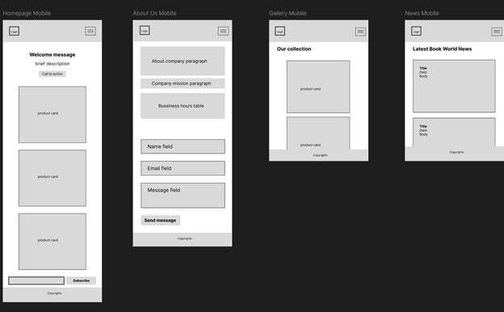

# Book Haven Bookstore - Website Front-End

Book Haven Bookstore is a responsive e-commerce front-end designed to provide a visually appealing, easy-to-navigate, and accessible online presence for a local bookstore. The project emphasizes literary exploration and community, serving a broad audience of book lovers and knowledge seekers.

**Live Demo:**
[https://stackblitz.com/edit/stackblitz-starters-ng1xvede](https://stackblitz.com/edit/stackblitz-starters-ng1xvede)

**Figma Wireframes:**
[https://www.figma.com/design/2IXXRzkACgJWgK2kyE9pUj/Book-Haven?node-id=0-1&t=205aMKImhMi0hQAp-1](https://www.figma.com/design/2IXXRzkACgJWgK2kyE9pUj/Book-Haven?node-id=0-1&t=205aMKImhMi0hQAp-1)

## Table of Contents

- [Quickstart](#quickstart)
- [Key Features](#key-features)
- [Technology Stack](#technology-stack)
- [Design Philosophy](#design-philosophy)
  - [Color Palette](#color-palette)
  - [Logo](#logo)
  - [Typography](#typography)
  - [Accessibility](#accessibility)
- [Website Structure](#website-structure)
  - [Home Page](#home-page)
  - [Gallery Page](#gallery-page)
  - [About Us Page](#about-us-page)
  - [News Page (Custom)](#news-page-custom)
- [Core Functionality](#core-functionality)
  - [Navigation](#navigation)
  - [Newsletter Subscription](#newsletter-subscription)
  - [Shopping Cart](#shopping-cart)
  - [Contact Form](#contact-form)
  - [Dynamic Content Loading](#dynamic-content-loading)
- [Data Persistence](#data-persistence)
- [Screenshots](#screenshots)
  - [Wireframes](#wireframes)
  - [Homepage](#homepage-screenshots)
  - [Gallery & Cart Functionality](#gallery--cart-functionality)
  - [About Us Page & Contact Form](#about-us-page--contact-form)
  - [News Page](#news-page-screenshots)
- [Development Notes & Known Limitations](#development-notes--known-limitations)

## Quickstart

To run this project locally, you'll need [Node.js](https://nodejs.org/) and npm installed.

1.  **Clone the repository:**
    ```bash
    git clone https://github.com/NIKDISSV-Forever/book-haven-bookstore.git
    cd book-haven-bookstore
    ```

2.  **Install dependencies:**
    Open your terminal in the project's root directory and run:
    ```bash
    npm install
    ```

3.  **Start the development server:**
    After the installation is complete, run:
    ```bash
    npm start
    ```

## Key Features

*   **Responsive Design:** Adapts seamlessly to desktop and mobile devices.
*   **Product Gallery:** Displays books with images and descriptions.
*   **Shopping Cart:** Allows users to add/remove items, view cart, and simulate an order. Cart data persists across sessions using `localStorage`.
*   **Newsletter Subscription:** Users can subscribe with their email.
*   **Contact Form:** Enables users to send messages to the bookstore.
*   **Custom News Page:** Displays placeholder book world news.
*   **Accessibility Focused:** Designed with high contrast, clear labels, and image alt text.

## Technology Stack

*   **HTML5:** For structuring the web pages.
*   **CSS3:** For styling, including custom styles and Bootstrap.
*   **JavaScript (ES6+):** For dynamic functionality, DOM manipulation, and client-side logic.
*   **Bootstrap 5:** For responsive layout and pre-styled components.
*   **`localStorage`:** For client-side storage of shopping cart data.

## Design Philosophy

The design aims for a sophisticated, calming, and accessible user experience.

### Color Palette
*   **Primary Palette (Color Palette 1):**
    *   Inkwell Blue (`#2E4057`)
    *   Intensity Indigo (`#EE583F`)
    *   Dusty Rose (`#F7B3CC`)
    *   Aged Gold (`#C7B65E`)
    *   Parchment White (`#FFF7EE`)
*   **Rationale:** Muted, high-contrast colors create a sophisticated and calming atmosphere suitable for a bookstore, ensuring elegance, warmth, and accessibility (colorblind-safe considerations).
*   **Font Color:** Bookish Black (`#131C26`) for excellent readability against the chosen palette.

### Logo
*   Simple, clean design featuring an open book.
*   Easily identifiable even with muted colors, designed to be colorblind-safe.

### Typography
*   **Typography Option 2:**
    *   **Titles (Large):** Arial Bold 30px
    *   **Titles:** Arial Bold 25px
    *   **Subtitle:** Comfortaa Normal 15px
    *   **Body (Large):** Calibri Normal 20px
    *   **Body (Strong):** Calibri Bold 16px
    *   **Body:** Calibri Normal 16px
    *   **Captions:** Arial Bold 11px
*   **Rationale:** Provides a clean, modern, and highly legible design. Arial and Calibri are web-safe and widely supported. Comfortaa adds personality without sacrificing readability. Varied weights and sizes create a clear visual hierarchy. Script fonts were avoided for better screen readability.

### Accessibility
*   **High Contrast:** Colors selected for sufficient contrast. Verified using [color.adobe.com](https://color.adobe.com/ru/Color-Palette-1-color-theme-4b020c77-5ec5-46c0-b717-31de171c995d/).
*   **Semantic HTML:** Used where appropriate.
*   **Image Descriptions:** All significant images include `alt` text.
*   **Form Labels:** Clear labels for all form fields.

## Website Structure

The website comprises the following main pages:

### Home Page
*   **URL:** `index.html` (or root `/`)
*   **Content:**
    *   Navigation Bar
    *   Hero Section (Large image, brief description)
    *   Featured Books/Products (Grid - placeholder "Recent releases")
    *   Call to Action ("Browse our collection")
    *   Newsletter Subscription Form

### Gallery Page
*   **URL:** `gallery.html`
*   **Content:**
    *   Header (Title)
    *   3x3 Grid of product images with "Add to Cart" functionality. Images have alt text.

### About Us Page
*   **URL:** `about.html`
*   **Content:**
    *   Header (Title)
    *   Store's history, values, and mission.
    *   Business Hours (Table)
    *   Contact Form (Name, Email, Message)

### News Page (Custom)
*   **URL:** `news.html`
*   **Content:**
    *   Header (Title)
    *   List of news articles with titles, dates, and body content (placeholder content).

## Core Functionality

### Navigation
*   A responsive navbar that collapses on mobile devices.
*   Provides easy access to all main pages (About Us, Gallery, News, View Cart).

### Newsletter Subscription
*   Located on the homepage.
*   Users submit their email; an alert confirms submission.

### Shopping Cart
*   **Add to Cart:** Users can add books from the gallery to their cart.
*   **View Cart:** Accessible via a "View Cart" button in the navbar. Displays cart contents in a modal.
*   **Cart Management:** Users can remove individual items or clear the entire cart.
*   **Order Simulation:** "Order" button simulates a purchase and clears the cart.
*   **Persistence:** Cart state is saved in `localStorage` to persist across page reloads and sessions.
*   **Dynamic Updates:** Cart modal updates in real-time.

### Contact Form
*   Located on the "About Us" page.
*   Users submit their name, email, and message.
*   A "Thank you" alert appears upon successful submission.

### Dynamic Content Loading
*   Product items on the gallery page and news items on the news page are loaded dynamically via JavaScript objects. This structure is designed for potential future integration with a backend API or database for scalability.

## Data Persistence

*   **`localStorage`:** Used exclusively for the "Add to Cart" feature, allowing users to retain their cart items between browsing sessions.

## Screenshots

### Wireframes

**Mobile Wireframes:**



**Desktop Wireframes:**


### Homepage Screenshots

**Homepage View:**


**Newsletter Subscription Validation:**


### Gallery & Cart Functionality

**Gallery Page ("Our Collection"):**


**"Item Added to Cart" Notification:**


**Shopping Cart Modal (with items):**


**"Thank You For Your Purchase" Notification:**


**Empty Cart Modal & Notification:**


**`localStorage` (Empty Cart State):**


### About Us Page & Contact Form

**About Us Page View:**


**Contact Form Submission Data (Console):**


**Contact Form Validation (Name Field):**


**Contact Form Validation (Email Field):**


### News Page Screenshots

**Custom News Page ("Latest Book World News"):**


## Development Notes & Known Limitations

*   **Styling Dependencies:** Relies on Bootstrap for its base responsive framework, with `style.css` for custom overrides and specific component styling (e.g., `bg-inkwell`).
*   **No Backend Integration:**
    *   All "dynamic" content (products, news, "Recent Releases") is currently hardcoded in JavaScript objects. There is no actual database.
    *   Contact form submissions and newsletter subscriptions are client-side only (display an alert) and do not send data to a server.
    *   The "Order" functionality is a simulation and does not process real payments or orders.
*   **Placeholder Content:**
    *   "Recent releases" on the homepage are static placeholders.
    *   News content on the "News" page is generated by a neural network for placeholder purposes only.
*   **Templating:** No server-side or client-side templating engine (e.g., Jinja, Handlebars) is used. This led to some manual code duplication during development. Future iterations could benefit from such tools.
*   **Refactoring:** JavaScript for the gallery was refactored into a separate file for better organization.
